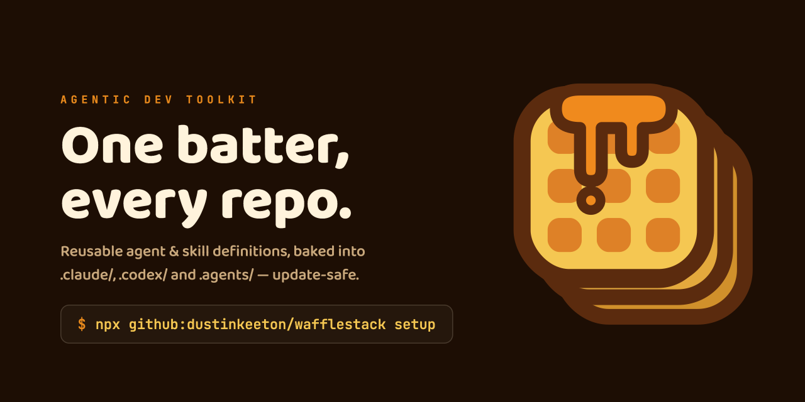

<p align="center">
  
</p>

<h1 align="center">WaffleStack</h1>

Reusable AI agent and skill definitions, distributed shadcn-style but <strong>update-safe</strong>.</p>

---

One canonical source repo, rendered into harness-native files inside each consuming
project — the same batter, baked fresh wherever you need it. Supported harnesses:
Claude Code (`.claude/agents`, `.claude/skills`), OpenAI Codex (`.codex/agents/*.toml`),
and the cross-tool agents dir (`.agents/skills`).

Bundles carry three payload types: **agents** and **skills** (rendered into those harness
dirs) and generic **files** — CI workflows, scripts, or config rendered verbatim to any
repo-relative path (`.github/workflows/…`, `scripts/…`), with the same `{{key}}`
substitution, lock tracking, and drift detection.

## Install into a project

**Guided (recommended)** — let your coding agent (Claude Code, Codex, …) drive the whole
setup. Kick it off one of two ways:

**Agent prompt** — paste to your coding agent:

```text
Set up wafflestack in this repo: run `npx github:dustinkeeton/wafflestack setup` and
follow the playbook it prints. Ask me which bundles to enable before you render.
```

**Inline shell (Claude Code / Codex)** — type in the prompt:

```text
! npx --yes github:dustinkeeton/wafflestack setup
```

> The `!` prefix runs a shell command in-session and feeds its output back to the model —
> supported in both Claude Code and OpenAI Codex; `--yes` keeps `npx` non-interactive.
> Running `setup` yourself just prints the playbook + inventory for an agent to act on, so
> there's no standalone "run it yourself" flavor for it.

`setup` prints an agent playbook plus an inventory of every bundle, config key, env
prerequisite, and service-side setup note — generated from the installed toolkit
version. The agent then detects targets and project commands, asks you which bundles
to enable, fills `.waffle.yaml`, verifies externals (e.g. `gh` auth and labels),
renders, runs `doctor`, and reports what it did.

**Manual** — no agent, just you and a shell (or delegate it with the guided prompt above):

**Run it yourself:**

```bash
cd your-project
npx github:dustinkeeton/wafflestack init     # writes a starter .waffle.yaml
# edit .waffle.yaml: pick bundles, fill in config values
npx github:dustinkeeton/wafflestack render   # renders all harness files + lock manifest
```

Pin a version with `npx github:dustinkeeton/wafflestack#v0.1.0 render`.

## Commands

| Command | What it does |
|---|---|
| `init` | Write a starter `.waffle.yaml` (won't overwrite an existing one). Add `--gitignore` to also append `.waffle.local.yaml` to `.gitignore`. |
| `setup` | Print the agent-driven install playbook + generated toolkit inventory (see above). |
| `render` | Regenerate every managed file verbatim from source + config; delete managed files that are no longer rendered; write `.waffle.lock.json`. |
| `install [ref…]` | With refs: add them to `.waffle.yaml` (bundle name → `bundles:`, item → `include:`), pull in their dependencies, then render. Refs are a bundle name, `skills/<name>`, `agents/<name>`, or `<bundle>/skills/<name>` (qualify when a name is in two bundles). Bare `install` = `render`. Add `--gitignore` to append the recommended ignore entries (`.waffle.local.yaml`, plus the configured `git.worktreesDir` when an enabled bundle declares one) — idempotent, existing content preserved. Also on `render`. |
| `upgrade` | Move an existing install across toolkit versions: compare the lock's `toolkitVersion` to the invoked toolkit, print the `CHANGELOG.md` entries in between, run any registered migrations in order, then re-render and run `doctor`. A missing lock or version degrades to a plain render + doctor with a clear note. See [Rules of the road](#rules-of-the-road). |
| `doctor` | Diff managed files against the lock manifest; report local edits, missing files, and env prerequisites. Exit 1 on drift. Add `--allow-missing` to tolerate absent renders (a CI drift gate for repos that gitignore some outputs): only *modified* files fail, missing ones are informational. |
| `eject <item>` | Stop managing an item (e.g. `skills/issue`, `agents/name`, `files/.github/workflows/ci.yml`): its rendered files stay put and become project-owned; also drops it from `include:`. |
| `validate` | Toolkit-developer lint: manifests parse, frontmatter is complete, every `{{placeholder}}` is declared, and agent `skills:` / `requires:` refs resolve. |

## Rules of the road

1. **Never edit rendered files** — `render` will overwrite them. Put project additions in
   `.waffle/extensions/{agents,skills}/<name>.md` (appended to the rendered item)
   and project parameters in `.waffle.yaml`.
2. **Account-specific values** (bot identities, board IDs) go in `.waffle.local.yaml`,
   which is gitignored and merged over the committed config. Config values may reference
   other keys with `{{...}}` (nested substitution) — so a committed value can point at a
   key kept in the local overlay. wafflestack never edits your `.gitignore` *unasked*, but
   `wafflestack install --gitignore` (or the setup agent, on your approval) appends the
   entries for you — the local overlay always, plus the configured worktrees directory.
3. **Updates are re-renders — until they aren't.** For patch/minor tags,
   `npx github:dustinkeeton/wafflestack#<newtag> render` regenerates everything and your
   config and extensions survive untouched. For a **breaking** tag (a renamed/removed item,
   a new required config key, a changed file layout), reach for
   `npx github:dustinkeeton/wafflestack#<newtag> upgrade` instead: it reads your lock's
   `toolkitVersion`, prints what changed since (from `CHANGELOG.md`), runs the registered
   migrations in order, then re-renders and runs `doctor`. See
   [versioning contract](#versioning-and-upgrades) below.
4. `doctor` tells you when local edits have crept into managed files, and doubles as a
   **CI drift gate** — run `npx github:dustinkeeton/wafflestack doctor` on PRs to fail the
   build if any managed file was hand-edited. When a repo deliberately gitignores some
   renders (so they're legitimately absent in a fresh CI checkout), add `--allow-missing`:
   absent files are then reported informationally and only *modified* files fail the gate. A
   missing lock still fails — that means the repo was never rendered, which the flag won't mask.

**Run the drift gate** — the `doctor` command from rule 4, in three copyable forms:

**Agent prompt** — paste to your coding agent:

```text
Check this repo for wafflestack drift: run `npx github:dustinkeeton/wafflestack doctor`
(add `--allow-missing` if we gitignore some renders) and summarize any modified or
missing managed files.
```

**Inline shell (Claude Code / Codex)** — type in the prompt:

```text
! npx --yes github:dustinkeeton/wafflestack doctor
```

**Run it yourself:**

```bash
npx github:dustinkeeton/wafflestack doctor   # add --allow-missing in CI when some renders are gitignored
```

## Versioning and upgrades

WaffleStack ships as git tags (`vX.Y.Z`), and the version is semver **read from a
consumer's point of view**:

| Bump | Example | What it means for you | How to take it |
|---|---|---|---|
| patch | `0.5.0 → 0.5.1` | content-only fixes | `… render` |
| minor | `0.5.0 → 0.6.0` | new bundles/items, additive config | `… render` |
| major / breaking | renamed or removed item, new **required** config key, changed file layout | needs a migration | `… upgrade` |

**Canonical upgrade command** — three copyable forms:

**Agent prompt** — paste to your coding agent:

```text
Upgrade wafflestack in this repo to <newtag>: run
`npx github:dustinkeeton/wafflestack#<newtag> upgrade`, review the CHANGELOG entries it
prints, let it run migrations and re-render, then run `doctor` and tell me what changed
and anything I still owe (e.g. `.gitignore` updates).
```

**Inline shell (Claude Code / Codex)** — type in the prompt:

```text
! npx --yes github:dustinkeeton/wafflestack#<newtag> upgrade
```

**Run it yourself:**

```bash
npx github:dustinkeeton/wafflestack#<newtag> upgrade
```

`upgrade` compares the `toolkitVersion` recorded in your `.waffle.lock.json` to the
toolkit you invoked, prints the [`CHANGELOG.md`](CHANGELOG.md) entries in between (each
release carries a **Consumer impact** line), runs any registered migrations in
`(lockVersion, toolkitVersion]` order, then re-renders and runs `doctor`. Migrations are
ordered, idempotent, and keyed to the version that introduced the change, so running
`upgrade` on an already-current repo is a safe no-op. If the lock is missing or predates
version stamping, `upgrade` says so and falls back to a plain render + `doctor`.

The first such migration is **0.6.0**, which shortens the consumer dotfiles
(`.wafflestack.yaml` → `.waffle.yaml`, plus the local overlay, lock, and
`.wafflestack/extensions/` → `.waffle/extensions/`). You don't have to rename anything by
hand: any `render` or `upgrade` moves the legacy files in place and reminds you to update
the matching `.gitignore` entries (the auto-rename never edits `.gitignore` — swap them
yourself, or run `wafflestack install --gitignore` to re-add the `.waffle.*` names). Until
you re-render, the old `.wafflestack.*` names keep working with a deprecation note.

Format details: [schema/FORMAT.md](schema/FORMAT.md). Brand assets and guidelines:
[assets/](assets/).

## License

© 2026 Dustin Keeton. Licensed under the [Apache License, Version 2.0](LICENSE).

---

<p align="center">
  <br>
  A <strong>WaffleWorks</strong> project — controlled fun, one waffle at a time.
</p>
